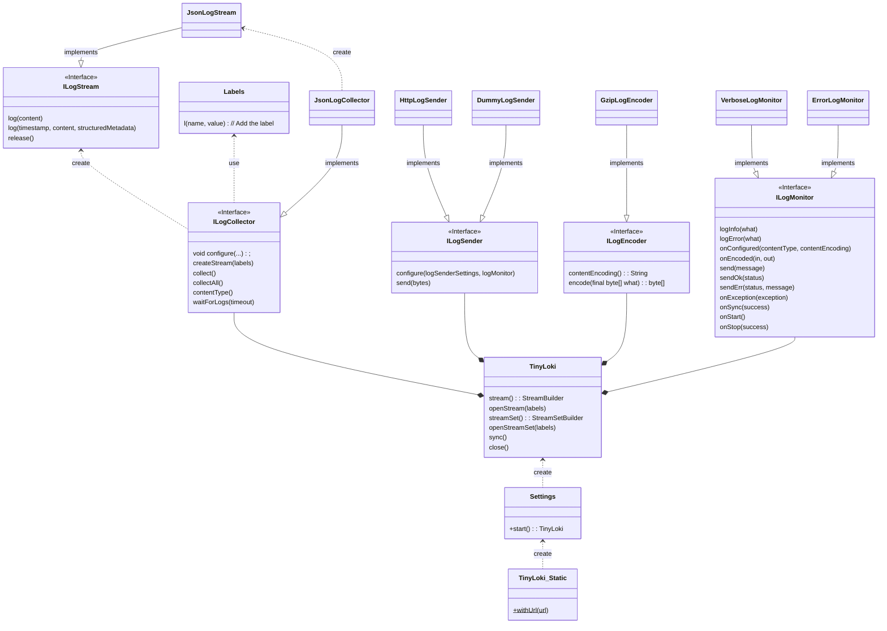

# mjaron-tinyloki-java

Building  
[](https://github.com/mjfryc/mjaron-tinyloki-java/actions/workflows/gradle.yml)
[](https://github.com/mjfryc/mjaron-tinyloki-java/actions/workflows/gradle-publish.yml)
[](https://search.maven.org/artifact/io.github.mjfryc/mjaron-tinyloki-java/)

Code quality  
[](https://github.com/mjfryc/mjaron-tinyloki-java/actions/workflows/codeql.yml)

[](https://sonarcloud.io/summary/new_code?id=mjfryc_mjaron-tinyloki-java)
[](https://sonarcloud.io/summary/new_code?id=mjfryc_mjaron-tinyloki-java)
[](https://sonarcloud.io/summary/new_code?id=mjfryc_mjaron-tinyloki-java)
[](https://sonarcloud.io/summary/new_code?id=mjfryc_mjaron-tinyloki-java)

Unit tests  


Tiny [Grafana Loki](https://grafana.com/oss/loki/) client (log sender) written in pure Java 1.8 without any external
dependencies. One of Grafana Loki third-party clients mentioned
in [documentation](https://grafana.com/docs/loki/v3.4.x/send-data/). It is customizable and easy to integrate
but is not optimized for performance.
See other reliable clients mentioned in documentation.

* Implements JSON variant of [Loki API](https://grafana.com/docs/loki/latest/api/#post-lokiapiv1push)
* Works with **Android** and **Java SE**
* Thread safe
* May added to [java.util.logging](https://docs.oracle.com/javase/8/docs/api/java/util/logging/package-summary.html)
  as a log [Handler](https://docs.oracle.com/javase/8/docs/api/java/util/logging/Handler.html)
  (and then may be called from [SLF4J](https://www.slf4j.org/)
  using [slf4j-jdk14 provider](https://www.slf4j.org/manual.html)).

## Examples

* See [./integration-test-server/README.md](./integration-test-server/README.md) to start the Grafana Loki server
  collecting the logs from examples.
* See [IntegrationTest.java](./src/test/java/pl/mjaron/tinyloki/IntegrationTest.java) to see more examples.
* Gradle: `implementation 'io.github.mjfryc:mjaron-tinyloki-java:1.1.6'`

### Short example

```java
import pl.mjaron.tinyloki.*;

public class Sample {
    public static void main(String[] args) {
        TinyLoki loki = TinyLoki.withUrl("http://localhost:3100")
                .withBasicAuth("user", "pass")
                .open();
        ILogStream logStream = loki.stream().info().l("topic", "shortExample").open();
        logStream.log("Hello world!");
        loki.closeSync();
    }
}
```

### Verbose example

```java
import pl.mjaron.tinyloki.*;

public class Sample {
    public static void main(String[] args) {

        // Initialize the log controller instance with URL.
        // The endpoint loki/api/v1/push will be added by default if missing.
        // Usually creating more than one TinyLoki instance doesn't of sense.
        // TinyLoki (its default IExecutor implementation) owns separate thread which
        // sends logs periodically.
        // It may be called inside try-with-resources block, but the default close()
        // method doesn't synchronize the logs, but just interrupts the background worker
        // thread.
        try (TinyLoki loki = TinyLoki.withUrl("http://localhost:3100/loki/api/v1/push")

                // Print all diagnostic information coming from the TinyLoki library.
                // For diagnostic purposes only.
                // The messages are printed only if there is no log encoder -
                // let's comment out .withGzipLogEncoder() to skip encoding.
                .withVerboseLogMonitor(true)

                // Set the custom log processing interval time.
                // So the executor will try to send the next logs 10 seconds after
                // the previous logs sending operation.
                .withThreadExecutor(10 * 1000)

                // Set custom time of HTTP connection establishing timeout.
                .withConnectTimeout(10 * 1000)

                // Encode the logs to limit the size of data sent.
                // .withGzipLogEncoder()

                // The BasicBuffering is set by default, but here the (not encoded)
                // message size limit may be customized.
                .withBasicBuffering(3 * 1024 * 1024, 10)

                // The timestamp provider allows deciding what to do with logs having
                // same labels and same message.
                // Grafana Loki treats such logs as duplicates and ignores them,
                // even if structured metadata is different.
                // To receive duplicated logs, call withIncrementingTimestampProvider()
                // to set the timestamp provider which always increases the log timestamp
                // nanosecond value.
                .withIncrementingTimestampProvider()

                // Let's define some labels common for few streams.
                .withLabels(Labels.of("topic", "verboseExample").l(Labels.SERVICE_NAME, "example_service"))

                // Initialize the library with above settings.
                // The ThreadExecutor will create a new thread and start waiting
                // for the logs to be sent.
                .open()) {

            // Some logs here...

            ILogStream topicStream = loki.stream().open();
            topicStream.log("Hello world.");

            ILogStream whiteStream = loki.stream().l("color", "white").open();
            whiteStream.log("Hello white world.");

            // Blocking method, tries to send the logs ASAP and wait for sending completion.
            // This method returns false when timeout occurs, but true when sending has completed with success or failure.
            boolean allHttpSendingOperationsFinished = loki.sync();
            System.out.println("Are all logs processed: " + allHttpSendingOperationsFinished);

            ILogStream redStream = loki.stream().l("color", "red").open();

            // Let's attach the Grafana Loki structured metadata.
            // In current implementation, the duplicated logs with same log line and timestamp (structured metadata doesn't matter) - is sent but may be dropped by Grafana Loki.
            redStream.log("Hello red world 0", Labels.of("structured_metadata_label", 0).l("other_structured_metadata_label", 'a'));
            redStream.log("Hello red world 1", Labels.of("structured_metadata_label", 9).l("other_structured_metadata_label", 'z'));

            StreamSet streamSet = loki.streamSet().l("stream_set_label", "value").open();
            streamSet.debug().log("The debug level line. It contain the following labels: topic, stream_set_label, level");
            streamSet.info().log("The info level line.", Labels.of("structured_metadata_label", "Of info stream set log."));

            // Blocking method, tries to synchronize the logs than interrupt and join the execution thread.
            // Set the custom timeout time for this operation.
            boolean closedWithSuccess = loki.closeSync(5 * 1000);

            System.out.println("Synced and closed with success: " + closedWithSuccess);
        }
    }
}
```

### SLF4J with java.util.logging example

```groovy
dependencies {
    implementation("org.slf4j:slf4j-jdk14:2.0.17")
    implementation("org.slf4j:slf4j-api:2.0.17")
    implementation("io.github.mjfryc:mjaron-tinyloki-java:1.1.6")
}
```

```java
import pl.mjaron.tinyloki.*;
import org.slf4j.Logger;
import org.slf4j.LoggerFactory;

public class Sample {
    public static void main(String[] args) {

        TinyLokiJulHandler.install(TinyLoki
                .withUrl("http://localhost:3100")
                .withBasicAuth("user", "pass")
                .withLabels(Labels.of(Labels.SERVICE_NAME, "integration_test")));

        Logger logger = LoggerFactory.getLogger("julIntegrationTest");
        logger.info("Hello info.");
    }
}
```

## Integration

### Maven Central

```gradle
    implementation 'io.github.mjfryc:mjaron-tinyloki-java:1.1.6'
```

_[Maven Central page](https://search.maven.org/artifact/io.github.mjfryc/mjaron-tinyloki-java/),_
_[Maven Central repository URL](https://repo1.maven.org/maven2/io/github/mjfryc/mjaron-tinyloki-java/)_

### GitHub Packages

Click the [Packages section](https://github.com/mjfryc?tab=packages&repo_name=mjaron-tinyloki-java) on the right.

### Download directly

1. Click the [Packages section](https://github.com/mjfryc?tab=packages&repo_name=mjaron-tinyloki-java) on the right.
2. Find and download jar package from files list to e.g. `your_project_root/libs` dir.
3. Add this jar to project dependencies in build.gradle, e.g:

```gradle
    implementation files(project.rootDir.absolutePath + '/libs/mjaron-tinyloki-java-1.1.6.jar')
```

## Features description

### Structured metadata

The [structured metadata](https://grafana.com/docs/loki/v3.4.x/get-started/labels/structured-metadata/) has been enabled
by default in [Grafana Loki 3.0.0](https://grafana.com/docs/loki/v3.4.x/setup/upgrade/#loki-300).
To put structured metadata to the log line, add it as the last argument of logging method.

### Preserve duplicated logs

When sending two same logs in same time, the Loki server ignores the second one:

```java
class Sample {
    public static void sample() {
        TinyLoki loki = TinyLoki.withUrl("http://localhost:3100")
                .withCurrentTimestampProvider().open();
        ILogStream stream = loki.stream().open();
        stream.log("Hello world.");
        stream.log("Two same logs.");

        // This log may be ignored if the CurrentTimestampProvider
        // will provide the same timestamp for both same logs.
        stream.log("Two same logs.");

        loki.closeSync();
    }
}
```

To preserve all logs, call the `withIncrementingTimestampProvider()` to set the sequential timestamps
(one nanosecond later). Then the Grafana Loki will not ignore duplicated logs.

### Logs buffering

Since the TinyLoki `v1.0.0`, the logs are buffered to optimize network load.
The logs buffering times (duration between two log sending operations) may be configured with:

```java
public Settings withThreadExecutor(final int processingIntervalTime);
```

If any buffers are full, the log data may be sent immediately.
Grafana Loki restricts the max message size and drops too big messages.
If this size is exceeded, the server may respond with HTTP error `500`, e.g:

```
rpc error: code = ResourceExhausted desc = grpc: received message larger than max (6331143 vs. 4194304)
```

By default (`BasicBuffering`) The TinyLoki tries to fill the data buffers and if the next log would exceed the size
limit,
new buffer is allocated instead. Custom buffer size may be configured with:

```java
public Settings withBasicBuffering(final int maxMessageSize, final int maxBuffersCount);
```

## API design


