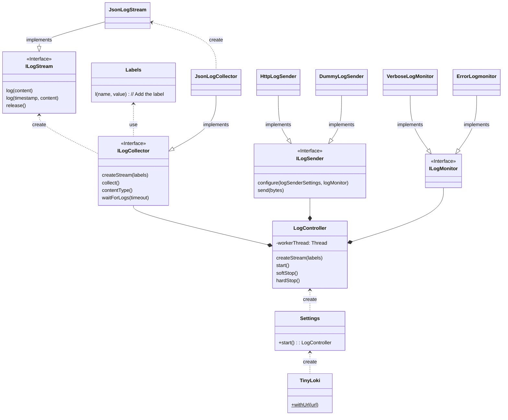

# mjaron-tinyloki-java

[](https://github.com/mjfryc/mjaron-tinyloki-java/actions/workflows/gradle.yml)
[](https://github.com/mjfryc/mjaron-tinyloki-java/actions/workflows/gradle-publish.yml)
[](https://search.maven.org/artifact/io.github.mjfryc/mjaron-tinyloki-java/)

Tiny [Grafana Loki](https://grafana.com/oss/loki/) client (log sender) written in pure Java 1.8 without any external dependencies.

* Implements JSON variant of [Loki API](https://grafana.com/docs/loki/latest/api/#post-lokiapiv1push)
* Works with **Android** and **Java SE**
* Thread safe

## API description

HTTP sender requires http URL, optionally basic authentication credentials may be set.

Short example:
```java
import pl.mjaron.tinyloki.*;

public class Sample {
    public static void main(String[] args) {

        LogController logController = TinyLoki
                .withUrl("http://localhost/loki/api/v1/push")
                .withBasicAuth("user", "pass")
                .start();

        ILogStream stream = logController.stream() // Before v0.3.2 use createStream()
                .info()
                .l("host", "MyComputerName")
                .l("customLabel", "custom_value")
                .build();
        );

        stream.log("Hello world.");

        logController.softStop().hardStop();
    }
}
```

Verbose example:

```java
import pl.mjaron.tinyloki.*;

public class Sample {
    public static void main(String[] args) {

        // Initialize log controller instance with URL.
        // Usually creating more than one LogController instance doesn't make sense.
        // LogController owns separate thread which sends logs periodically.
        LogController logController = TinyLoki
                .withUrl("http://localhost/loki/api/v1/push")
                .withBasicAuth("user", "pass")
                .start();

        // Create streams. It is thread-safe.
        ILogStream stream = logController.createStream(
                // Define stream labels...
                // Initializing log level to verbose and adding some custom labels.
                TinyLoki.verbose()
                        .l("host", "MyComputerName")        // Custom static label.
                        .l("customLabel", "custom_value")   // Custom static label.
                // Label names should start with letter
                //     and contain letters, digits and '_' only.
                // Bad characters will be replaced by '_'.
                //     If first character is bad, it will be replaced by 'A'.
        );

        // ... new streams and other logs here (thread-safe, non-blocking).
        stream.log("Hello world.");

        // Optionally flush logs before application exit.
        logController
                .softStop()     // Try to send logs last time. Blocking method.
                .hardStop();    // If it doesn't work (soft timeout) - force stop sending thread.
    }
}
```

## Integration

### Maven Central

```gradle
    implementation 'io.github.mjfryc:mjaron-tinyloki-java:0.3.3'
```

 _[Maven Central page](https://search.maven.org/artifact/io.github.mjfryc/mjaron-tinyloki-java/),_
 _[Maven Central repository URL](https://repo1.maven.org/maven2/io/github/mjfryc/mjaron-tinyloki-java/)_

### GitHub Packages

Click the [Packages section](https://github.com/mjfryc?tab=packages&repo_name=mjaron-tinyloki-java) on the right.

### Download directly

1. Click the [Packages section](https://github.com/mjfryc?tab=packages&repo_name=mjaron-tinyloki-java) on the right.
2. Find and download jar package from files list to e.g. `your_project_root/libs` dir.
3. Add this jar to project dependencies in build.gradle, e.g:

```gradle
    implementation files(project.rootDir.absolutePath + '/libs/mjaron-tinyloki-java-0.3.3.jar')
```

## API design


